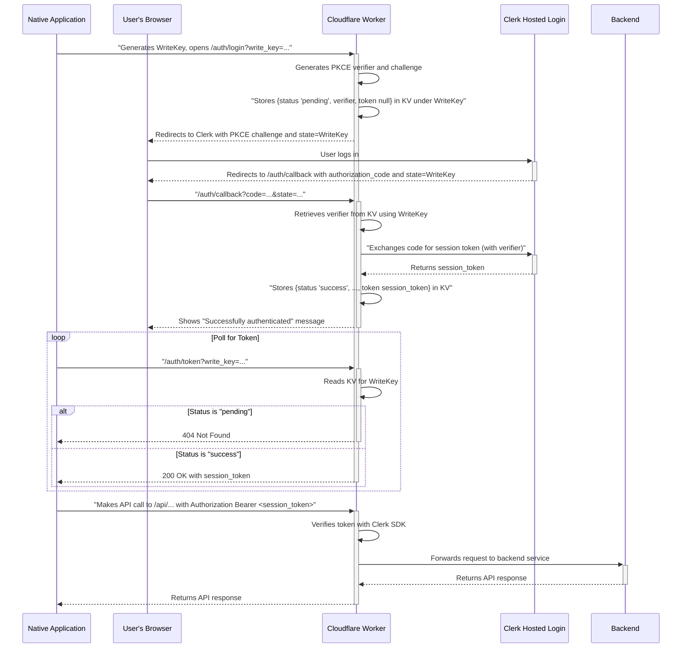

# Native Application Authentication Flow

This document outlines the authentication flow for native (desktop or mobile) applications using Clerk's hosted login pages, with this Cloudflare Worker acting as a secure intermediary.

## Overview

The process is designed to securely transfer a session token from a browser-based login session to a native application. It uses a temporary `WriteKey` to link the native app's session with the browser session and leverages Cloudflare KV to store the token. The entire flow is orchestrated by this worker.

## Sequence Diagram

The following diagram illustrates the interaction between the user's native application, the browser, this Cloudflare Worker, and Clerk.

## Step-by-Step Explanation

1.  **Initiation:** The native application generates a unique `WriteKey` and opens the user's browser to the `/auth/login` endpoint on this worker, passing the `WriteKey` as a query parameter.
2.  **PKCE Setup:** The worker generates a PKCE `code_verifier` and `code_challenge`. It stores the `code_verifier` in Cloudflare KV, keyed by the `WriteKey`, with a status of `"pending"`.
3.  **Redirect to Clerk:** The worker redirects the browser to Clerk's hosted login page, including the `code_challenge` and passing the original `WriteKey` in the `state` parameter.
4.  **User Authentication:** The user authenticates with Clerk.
5.  **Callback:** Clerk redirects the user back to the worker's `/auth/callback` endpoint, providing an authorization `code` and the `WriteKey` (in the `state` parameter).
6.  **Token Exchange:** The worker retrieves the `code_verifier` from KV using the `WriteKey`. It then communicates with Clerk to exchange the authorization `code` for a session token, providing the `code_verifier` as part of the PKCE flow.
7.  **Store Token:** The worker updates the record in KV, setting the `status` to `"success"` and storing the newly obtained session token.
8.  **Polling:** Meanwhile, the native application polls the `/auth/token` endpoint, sending its `WriteKey`. The worker will respond with a `404 Not Found` until the `status` in KV is `"success"`, at which point it will return the session token.
9.  **API Requests:** The native application can now make requests to the `/api/*` endpoints on this worker, including the session token in the `Authorization` header as a Bearer token. The worker will verify the token's validity before proxying the request to the backend service.

## DNS Configuration

To ensure this authentication flow works correctly, you must configure the following DNS records in your Cloudflare account to point to this Cloudflare Worker:

*   **Production:** A CNAME or A record for `collects.lqxclqxc.com` pointing to your Cloudflare Worker.
*   **Staging:** A CNAME or A record for `staging.collects.lqxclqxc.com` pointing to your Cloudflare Worker.

These routes are defined in the `wrangler.toml` file and are essential for the worker to receive the login and callback requests.
